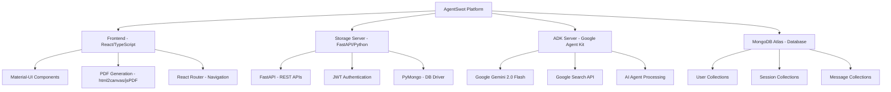
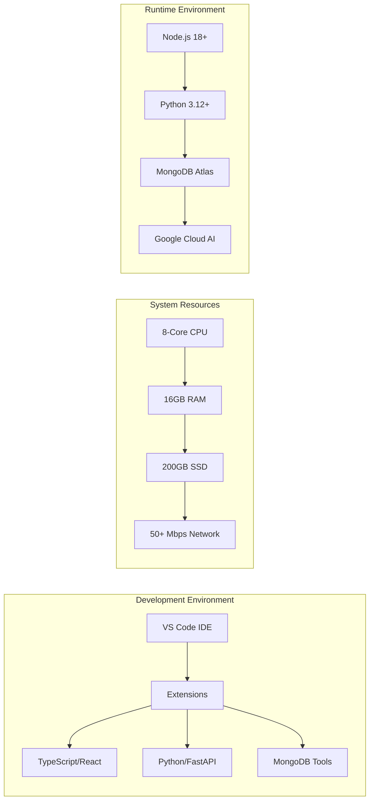
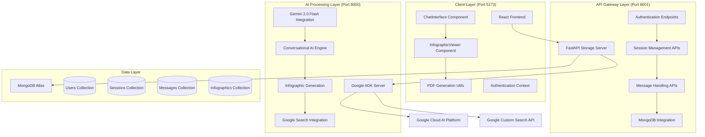
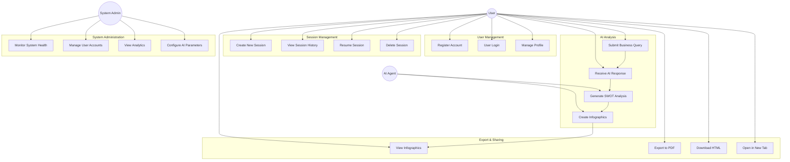
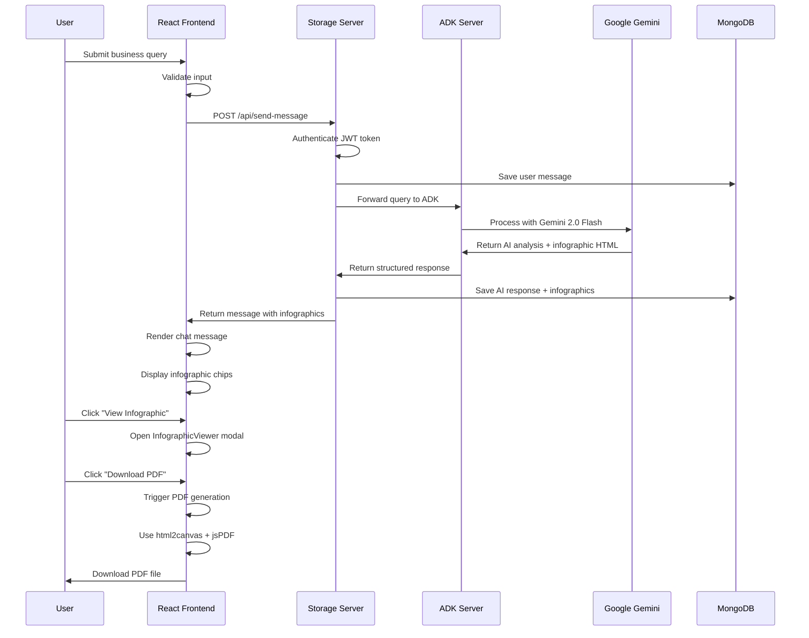
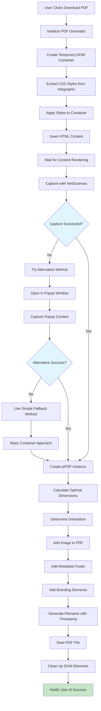
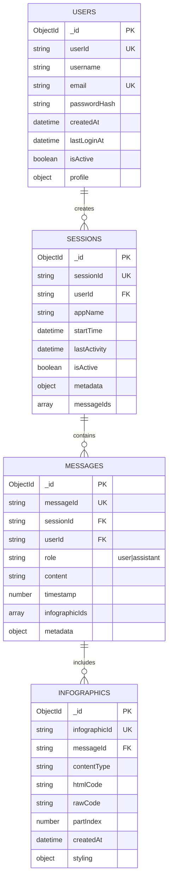
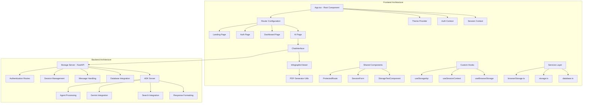
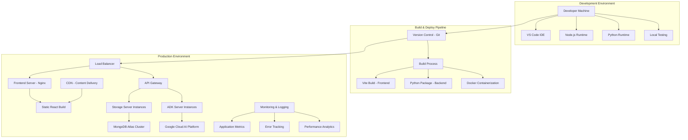

# Chapter 3 — System Design & Architecture

## 3.1 Software Requirements

### 3.1.1 Operating System
- **Primary OS**: Windows 10/11 (64-bit)
- **Alternative Support**: macOS 10.15+, Ubuntu 18.04+
- **Development Environment**: Cross-platform compatibility

### 3.1.2 Programming Languages & Frameworks

**Frontend Stack:**
- **Language**: TypeScript 5.0+ (JavaScript ES2022)
- **Framework**: React 18+ with functional components and hooks
- **Build Tool**: Vite 4.0+ for fast development and optimized builds
- **UI Framework**: Material-UI (MUI) v5 for modern component library

**Backend Stack:**
- **Language**: Python 3.12+
- **API Framework**: FastAPI 0.104+ for high-performance REST APIs
- **AI Integration**: Google Agent Development Kit (ADK)
- **Authentication**: JWT with bcrypt for secure user management

### 3.1.3 Libraries & Dependencies

**Frontend Libraries:**
```
- React Router v6 (navigation and routing)
- html2canvas (DOM to image conversion)
- jsPDF (PDF generation from canvas)
- React Toastify (user notifications)
- Axios (HTTP client for API communication)
```

**Backend Libraries:**
```
- FastAPI (async web framework)
- Pydantic (data validation and serialization)
- PyMongo (MongoDB async driver)
- Passlib[bcrypt] (password hashing)
- Google Cloud AI Platform (Gemini integration)
```

### 3.1.4 Database & External Services
- **Primary Database**: MongoDB Atlas (cloud-native NoSQL)
- **AI Service**: Google Gemini 2.0 Flash (conversational AI)
- **Search API**: Google Custom Search API
- **Authentication**: JWT-based session management



## 3.2 Hardware Requirements

### 3.2.1 Minimum Requirements
- **CPU**: 4-core processor (Intel i5-8400 / AMD Ryzen 5 2600 equivalent)
- **RAM**: 8 GB DDR4
- **Storage**: 50 GB available disk space (SSD recommended)
- **Network**: Broadband internet connection (10 Mbps minimum)
- **Graphics**: Integrated graphics sufficient (for PDF rendering)

### 3.2.2 Recommended Requirements
- **CPU**: 8-core processor (Intel i7-10700K / AMD Ryzen 7 3700X or higher)
- **RAM**: 16 GB DDR4 (32 GB for heavy concurrent usage)
- **Storage**: 200 GB SSD with NVMe interface
- **Network**: High-speed internet (50+ Mbps for optimal AI response times)
- **Graphics**: Dedicated GPU with 4+ GB VRAM (for enhanced canvas rendering)

### 3.2.3 Development Environment
- **IDE**: Visual Studio Code with extensions (TypeScript, Python, MongoDB)
- **Browser**: Chrome 90+ or Firefox 88+ (for development and testing)
- **Package Managers**: npm 9+, pip 23+



## 3.3 System Architecture & Design

### 3.3.1 Architecture Overview

AgentSwot implements a modern three-tier microservices architecture with clear separation of concerns. The system follows a client-server model where a React-based frontend communicates with FastAPI backend services, which in turn integrate with Google's AI infrastructure and MongoDB cloud database. This architecture ensures scalability, maintainability, and efficient resource utilization while providing seamless real-time AI-powered business analysis capabilities.



### 3.3.2 Use Case Diagram



### 3.3.3 Class Diagram

```mermaid
classDiagram
    class User {
        +string userId
        +string username
        +string email
        +string passwordHash
        +Date createdAt
        +Date lastLoginAt
        +boolean isActive
        +register()
        +login()
        +updateProfile()
        +changePassword()
    }
    
    class UserSession {
        +string sessionId
        +string userId
        +string appName
        +Date startTime
        +Date lastActivity
        +boolean isActive
        +Map~string, any~ metadata
        +createSession()
        +updateActivity()
        +endSession()
    }
    
    class ChatMessage {
        +string messageId
        +string sessionId
        +string userId
        +string role
        +string content
        +number timestamp
        +Array~InfographicData~ infographics
        +sendMessage()
        +addInfographic()
        +getMessageHistory()
    }
    
    class InfographicData {
        +string id
        +string contentType
        +string htmlCode
        +string rawCode
        +number partIndex
        +Date createdAt
        +generatePDF()
        +exportHTML()
        +openInNewTab()
    }
    
    class AIAgent {
        +string agentId
        +string model
        +Map~string, any~ configuration
        +processQuery()
        +generateSWOT()
        +createInfographic()
        +searchWeb()
    }
    
    class StorageServer {
        +FastAPI app
        +MongoClient database
        +JWTManager auth
        +authenticateUser()
        +createSession()
        +saveMessage()
        +getConversation()
    }
    
    class PDFGenerator {
        +html2canvas renderer
        +jsPDF creator
        +generatePDF()
        +captureElement()
        +optimizeLayout()
    }
    
    User ||--o{ UserSession : creates
    UserSession ||--o{ ChatMessage : contains
    ChatMessage ||--o{ InfographicData : includes
    AIAgent ||--|| ChatMessage : processes
    StorageServer ||--|| User : manages
    StorageServer ||--|| UserSession : handles
    StorageServer ||--|| ChatMessage : stores
    PDFGenerator ||--|| InfographicData : converts
```

### 3.3.4 Sequence Diagram - SWOT Analysis Flow



### 3.3.5 Activity Diagram - PDF Generation Process



### 3.3.6 Data Model & Database Schema



### 3.3.7 Component Architecture Diagram



### 3.3.8 Deployment Architecture



This comprehensive Chapter 3 provides detailed system design documentation with multiple Mermaid diagrams covering all aspects of your AgentSwot architecture, from high-level system overview to detailed component interactions and data models.&amp; Requirements
3.1 Software Requirements
List OS, programming languages, frameworks, libraries, database, IDE, and any external APIs.

Example:
 OS:
 Language:
 Libraries: (if used)
 Database:
3.2 Hardware Requirements
State minimum and recommended hardware: CPU, RAM, storage, GPU (if required), and
network needs. Example: “Min: 4-core CPU, 8 GB RAM, 100 GB disk; Recommended: 8-core,
16 GB RAM, GPU with 4 GB VRAM.”
3.3 Design (Architecture, UML diagrams, Data Model)
 Provide a one-paragraph overview of the architecture (client-server, microservices,
layered).
 Include diagrams: a high-level System Architecture diagram, Use Case diagram, one
Class diagram and one Sequence or Activity diagram.
 Describe data model/schema: tables, key fields and relationships (ER diagram).