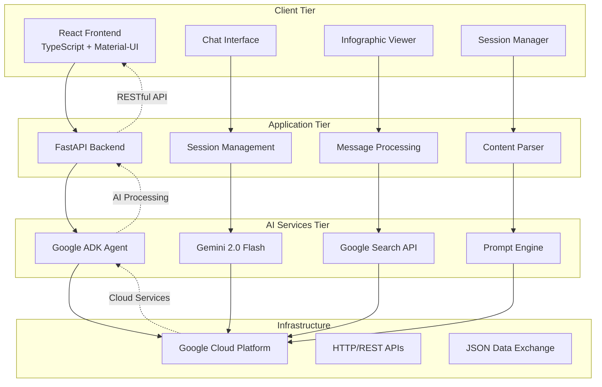
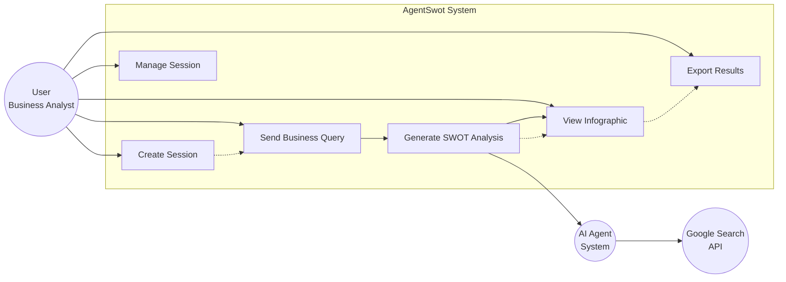
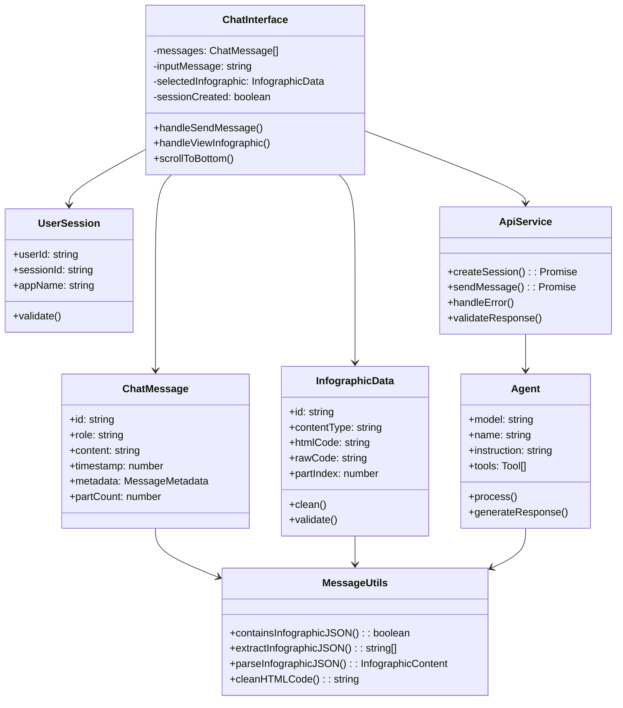
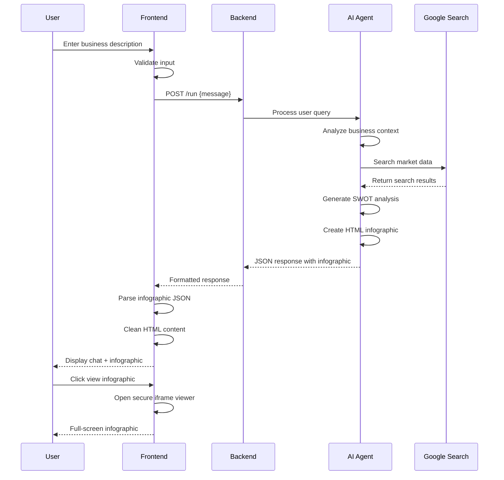
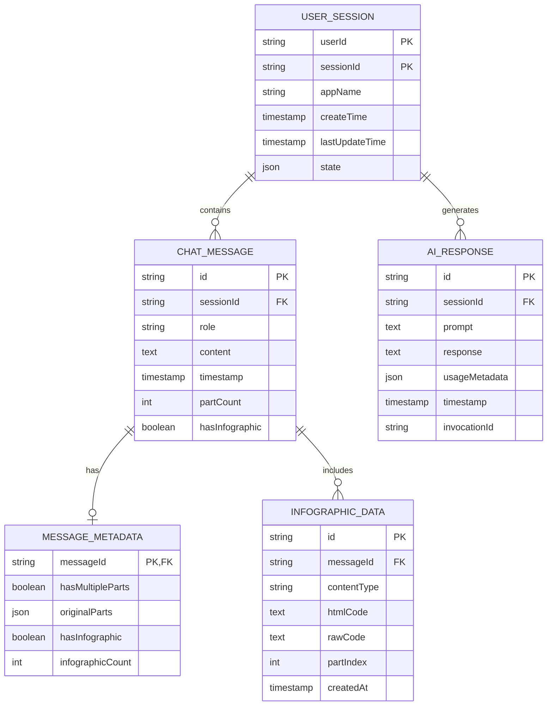

# Chapter 3 — Design & Requirements

## 3.1 Software Requirements

**OS:** Windows 10/11, macOS 10.15+, Linux Ubuntu 18.04+

**Language:** 
- Python 3.8+ (Backend AI agent development)
- TypeScript/JavaScript ES2020+ (Frontend development)
- HTML5/CSS3 (Dynamic infographic generation)

**Libraries:**
- **Backend:** google-adk, fastapi, uvicorn, python-dotenv, pydantic
- **Frontend:** React 18+, Material-UI 7.3+, axios 1.11+, react-router-dom 7.8+, uuid 11.1+
- **Development:** vite, typescript, eslint, prettier

**Database:** Session-based storage (no persistent database required for prototype)

**IDE:** Visual Studio Code with Python, React, and TypeScript extensions

**External APIs:**
- Google Gemini 2.0 Flash API (AI language model)
- Google Search API (real-time web search)
- Google Agent Development Kit (ADK) services

## 3.2 Hardware Requirements

**Minimum Requirements:**
4-core CPU (Intel i5/AMD Ryzen 5), 8 GB RAM, 100 GB SSD storage, integrated graphics, stable internet connection (10 Mbps)

**Recommended Requirements:** 
8-core CPU (Intel i7/AMD Ryzen 7), 16 GB RAM, 256 GB NVMe SSD, dedicated GPU with 4 GB VRAM (for development), high-speed internet (25+ Mbps)

**Network Requirements:**
Stable internet connectivity for Google Cloud API access, WebSocket support for real-time communication, CORS-enabled browser environment

## 3.3 Design (Architecture, UML diagrams, Data Model)

### Architecture Overview

AgentSwot follows a **microservices architecture** with clear separation between frontend React application, FastAPI backend service, and Google Cloud AI services. The system implements a client-server pattern where the React frontend communicates with the FastAPI backend through RESTful APIs, while the backend orchestrates AI agents using Google's ADK framework. This layered architecture ensures scalability, maintainability, and secure isolation between user interface, business logic, and AI processing components.

### System Architecture Diagram

### Use Case Diagram

### Class Diagram

### Sequence Diagram - SWOT Analysis Flow

### Data Model Schema

### Data Relationships

**Primary Entities:**
- **USER_SESSION**: Core session management with unique user-session combinations
- **CHAT_MESSAGE**: Individual messages with role-based classification (user/assistant)
- **INFOGRAPHIC_DATA**: Embedded visual content with secure HTML storage
- **AI_RESPONSE**: Complete AI interaction logs with metadata tracking

**Key Relationships:**
- One session contains multiple messages (1:N)
- One message can have one metadata record (1:1)
- One message can include multiple infographics (1:N)
- Session tracks all AI responses for audit trail (1:N)
